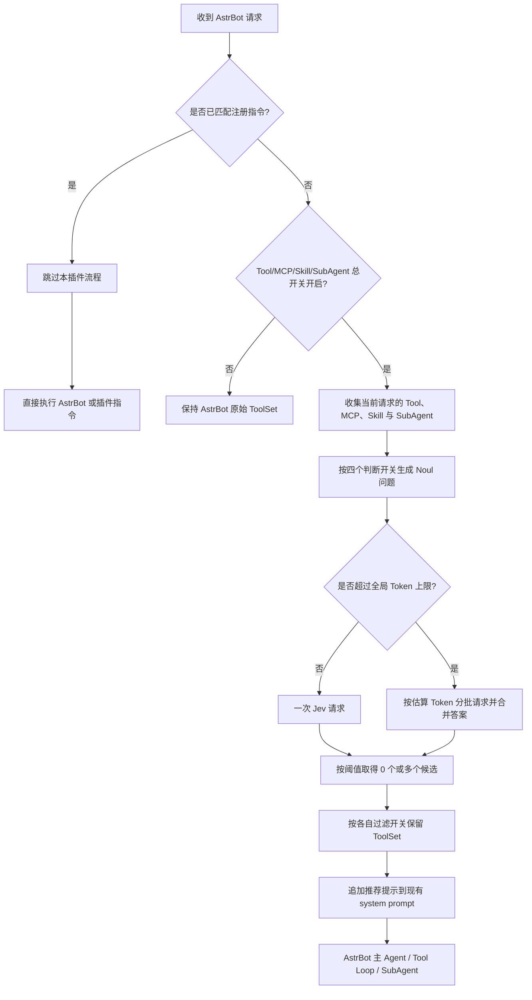
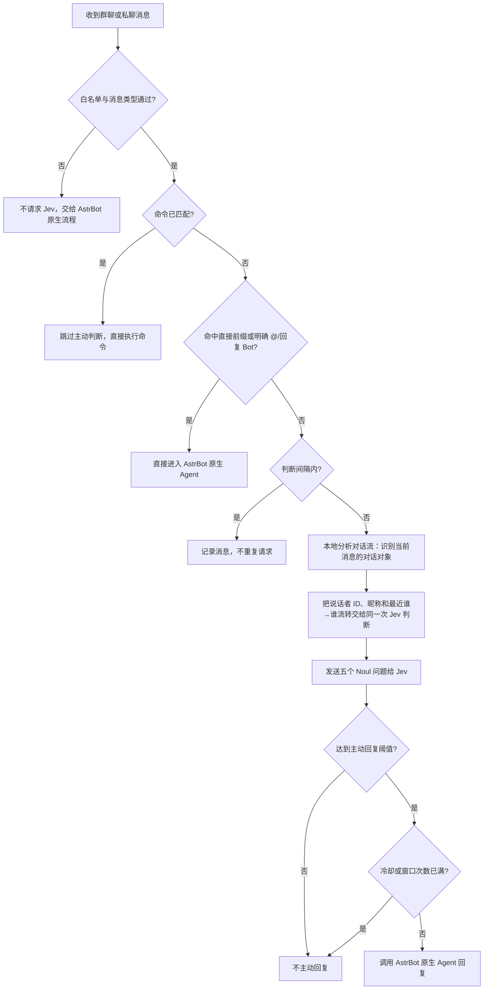
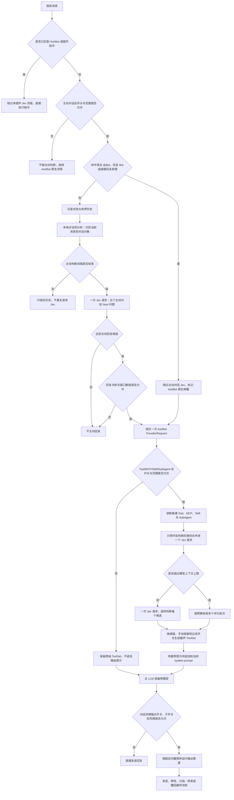

# jev决策综合插件

`jev决策综合插件` 是一个适用于 [AstrBot](https://github.com/AstrBotDevs/AstrBot) 的 Jev/SystemOne 决策插件。它在 AstrBot 把请求交给主 LLM 之前，先判断当前场景真正需要哪些 Tool、MCP 工具、Skill 和 SubAgent，必要时过滤掉无关能力，或者把候选写入主 LLM 的推荐提示词；它也可以在白名单群聊和私聊中判断机器人是否适合主动回复。

插件只负责结构化判断、能力路由和主动回复时机。最终回答、参数生成、工具执行、人格和会话上下文仍由 AstrBot 原生 Agent 负责。插件不会替换 AstrBot 的人格提示词，也不会覆盖其他插件追加到 system prompt 的内容。

## 你第一次安装时应该先知道什么

这个插件有两层配置：

- AstrBot 原生插件配置页只放全局服务参数和三个总开关。
- 插件详情页 WebUI 放 Tool、MCP、Skill、SubAgent、提示词、主动对话白名单和详细策略。

安装后的推荐顺序是：

1. 安装并启用插件。
2. 在 AstrBot 原生配置页填写 Jev 服务地址、路径、API 密钥和模型。
3. 打开需要使用的总开关：“Tool/MCP/Skill/SubAgent 决策”“主动对话”“对话流增强”。
4. 进入插件 WebUI，保存 Tool/MCP/Skill/SubAgent 和主动对话的详细规则。
5. 用 AstrBot 的插件热重载使原生全局参数重新初始化；WebUI 详细设置保存后会立即用于后续请求。

服务地址默认留空，不会预置任何第三方地址。API 密钥只应填写在 AstrBot 的密钥字段中，不要写进 README、截图、日志或 Git 提交。

## 功能概览

| 功能 | 做什么 | 是否改变 AstrBot 原生回答链 |
| --- | --- | --- |
| Tool 判断 | 让 Jev 逐项判断普通 Tool 是否适合当前请求 | 只调整本次请求可见的 ToolSet，并追加推荐提示 |
| MCP 判断 | 让 Jev 逐项判断每个 MCP 工具是否适合当前请求 | 与 Tool 相同，独立控制判断、过滤、保留和推荐 |
| Skill 判断 | 让 Jev 逐项判断每个 Skill 是否适合当前请求 | 控制 AstrBot 注入主 LLM 的 Skill 清单，并追加推荐提示 |
| SubAgent 判断 | 让 Jev 逐项判断是否值得委派给每个 SubAgent | 只调整本次请求可见的 handoff，并追加推荐提示 |
| `jev_decide` | 让主 LLM 按需调用 Jev 做一次 noul、choice 或 score 判断 | 不执行其他工具 |
| 主动对话 | 判断白名单会话现在是否适合 Bot 插话 | 满足条件后调用 AstrBot 原生 Agent |
| WebUI | 管理规则、提示词、工具来源和白名单 | 不替换 AstrBot 主 LLM 人格 |

## 主流程

Tool、MCP、Skill 和 SubAgent 判断会合并为一个 Jev 请求。没有超过上下文上限时只有一次请求，超过上限才分批；每个候选仍然独立判断，可以选中 0 个、1 个或多个。



命中已注册的 AstrBot 内置指令或插件指令时，AstrBot 的 waking-check 已经产生 `handlers_parsed_params`，插件会在主动判断和 LLM 工具路由处直接返回，不会让 Jev 延迟或改变指令执行。没有命中注册指令的 `/xxx` 只是普通文本；默认 `/` 是直接唤醒前缀，它可能进入 AstrBot 原生 Agent，此时 Agent 请求仍会经过 Tool/MCP/Skill/SubAgent 决策。

## 安装

### AstrBot 插件市场

1. 打开 AstrBot 管理面板的插件市场。
2. 搜索 `jev决策综合插件`，也可以搜索仓库名 `astrbot_plugin_decision`。
3. 安装并启用插件。
4. 打开原生配置页填写全局服务参数，再打开插件 WebUI 保存详细策略。

### GitHub 或手动安装

在 AstrBot 项目目录执行：

```bash
cd /root/yiyin/AstrBot
git clone https://github.com/yiyinfaith/astrbot_plugin_decision.git data/plugins/astrbot_plugin_decision
```

更新已有代码：

```bash
cd /root/yiyin/AstrBot/data/plugins/astrbot_plugin_decision
git pull --ff-only
```

手动复制时，目标目录必须是：

```text
<AstrBot>/data/plugins/astrbot_plugin_decision/
```

至少应包含 `main.py`、`_conf_schema.json`、`metadata.yaml`、`decision/`、`pages/` 和 `logo.png`。安装或更新后使用插件热重载，不需要重启整个 AstrBot。

## 第一步：配置全局参数

AstrBot 原生插件配置页中的项目如下：

| 配置项 | 默认值 | 作用 |
| --- | ---: | --- |
| 决策服务 | `systemone_jev` | 当前使用的决策 Provider |
| 服务地址 | 空 | Jev 服务基础 URL，例如 `https://example.com` |
| API 路径 | `/v1/systemone` | SystemOne 请求路径 |
| API 密钥 | 空 | Jev 服务密钥，AstrBot 会遮罩保存 |
| Jev 模型 | `jev-latest` | 发送给服务端的模型名 |
| 请求超时 | `5` 秒 | 每次 Jev 请求的超时时间 |
| 最大重试次数 | `1` | 首次失败后的额外重试次数；`0` 表示不重试 |
| 重试间隔 | `0` 秒 | 默认失败后立即重试 |
| 上下文上限 | `32000` Token | 主动对话超限时裁剪旧历史；Tool/MCP/Skill/SubAgent 超限时分批 |
| 上下文消息数 | `8` | Tool/MCP/Skill/SubAgent 判断使用的最多历史消息数 |
| 上下文字符数 | `6000` | Tool/MCP/Skill/SubAgent 判断状态中的历史字符上限 |
| Tool/MCP/Skill/SubAgent 决策 | 开启 | 整个 Tool/MCP/Skill/SubAgent 决策链总开关，不影响主动对话 |
| 主动对话 | 关闭 | 主动对话总开关，详细规则在 WebUI |
| 对话流增强 | 开启 | 输入增强和输出增强的总开关，详细配置在 WebUI |

服务地址和 API 路径会直接拼接成请求地址。服务地址填写 `https://example.com` 时，API 路径填写 `/v1/systemone`，不要把完整路径重复填写两次。

SystemOne 客户端默认只对超时、网络错误、429 和 5xx 重试；401/403、其他 4xx 和响应解析错误不会盲目重试。客户端会把单次请求超时至少限制为 1 秒。

## 第二步：配置插件 WebUI

WebUI 分为“Tool/MCP/Skill/SubAgent 决策”“主动对话”“对话流增强”三个区域。页面使用 Vue 3 和 Goose liquid-glass 组件；Goose 或 WebGL 不可用时会回退到原生控件，仍可查看和保存。原生配置页的三个总开关分别控制这三个区域；区域里的输入增强、输出增强开关只控制各自子功能。

### Tool、MCP、Skill 与 SubAgent：判断和过滤

普通 Tool、MCP、Skill 和 SubAgent 各有一个“判断”开关和一个“过滤”开关。四类开关可以使用不同组合，但 Jev 判断问题会合并处理。

| 判断 | 过滤 | 交给主 LLM 的能力 | 注入推荐提示词 |
| --- | --- | --- | --- |
| 开启 | 开启 | Jev 选中项 + “始终保留”项 | Jev 选中项 + “始终推荐给主 LLM”项 |
| 开启 | 关闭 | 全量保留 | Jev 选中项 + “始终推荐给主 LLM”项 |
| 关闭 | 开启 | 仅“始终保留”项 | 仅“始终推荐给主 LLM”项 |
| 关闭 | 关闭 | 全量保留 | 仅“始终推荐给主 LLM”项 |

“判断”决定是否把该类别送给 Jev；“过滤”只决定是否从本次交给主 LLM 的 ToolSet 中移除未保留候选。判断关闭时不会请求 Jev，但仍按该类别自己的过滤开关执行：过滤开只留手动保留，过滤关全量保留。

当前默认值是：判断 Tool 开、过滤 Tool 开；判断 MCP 开、过滤 MCP 开；判断 Skill 开、过滤 Skill 开；判断 SubAgent 开、过滤 SubAgent 关。这个默认组合会过滤 Tool、MCP 和 Skill，但让 SubAgent 全量可见，同时仍利用 Jev 生成四类能力推荐。

整个 Tool/MCP/Skill/SubAgent 决策区域还有一个独立的会话范围黑白名单：

- **黑名单模式（默认）**：名单内的群聊、私聊用户或完整 `unified_msg_origin` 不进行 Tool/MCP/Skill/SubAgent 决策；名单为空时全部应用。
- **白名单模式**：只对名单内会话进行 Tool/MCP/Skill/SubAgent 决策；名单为空时全部不应用。

范围不适用时，插件不会请求 Jev、不会过滤 ToolSet，也不会追加推荐提示词，AstrBot 会按原始能力集合继续处理请求。这个范围只控制 Tool/MCP/Skill/SubAgent 决策，不影响主动对话或对话流增强。

### Tool/MCP/Skill/SubAgent 决策

每个 Tool、MCP 工具、Skill 和 SubAgent 都有两个独立选项：

- **始终保留**：即使 Jev 没选中，过滤开启时也继续交给主 LLM。
- **始终推荐给主 LLM**：把该能力名称写入主 LLM 的推荐提示词。必须先勾选“始终保留”。

Jev 选中的候选会自动进入推荐提示词；仅勾选“始终保留”的候选只会保留，不会被插件主动推荐。MCP、Skill 和 SubAgent 的配置分别位于 WebUI 对应区域，不会与其他类别的手动列表混用。

Skill 不是函数工具，而是 AstrBot 注入 system prompt 的 `SKILL.md` 能力清单。插件会把 Skill 清单和其他三类能力放进同一次 Jev 判断；过滤开启时只保留 Jev 选中项和“始终保留”项，再从 AstrBot 已生成的 `## Skills` 区块中移除其他条目，不会改动人格或其他插件的 system prompt。Skill 的来源按 `SkillInfo.plugin_name` 归属插件；没有插件归属的本地、工作区或沙箱 Skill 单独显示为“Skill”。

列表会显示能力来源。同一插件的 Tool、MCP 或 Skill 会放在同一分组中；没有插件归属的 MCP 单独归为“MCP”，没有插件归属的 Skill 单独归为“Skill”。AstrBot 内置 Tool 显示为“Astrbot内置工具”并默认排在底部。首次打开页面时，内置 Tool 和 `jev_decide` 默认“始终保留”，默认不勾选“始终推荐给主 LLM”。

### `jev_decide` 工具

插件通过 `Context.add_llm_tools()` 注册 `jev_decide`，供主 LLM 按需调用。它不会执行其他工具，只向 Jev 请求一次结构化判断，支持：

- `decision_type`: `noul`、`choice` 或 `score`；
- `state`、`instructions`；
- `choice_options`: 至少两个 `{key, description}` 选项；
- `score_levels`: 有序评分等级。

`jev_decide` 的来源显示为“jev决策综合插件”，不是 AstrBot 内置工具。它默认始终保留，但默认不始终推荐给主 LLM。

### 两套提示词

WebUI 提供两套可编辑提示词：

1. **Jev 判断前提示词**：只发送给 Jev，说明它应该怎样做结构化判断，不会把主 LLM 人格 system prompt 原样发送给 Jev。
2. **判断后注入主 LLM 的提示词**：在 Jev 判断结束后追加到当前请求的 system prompt，支持 `{tools}`、`{mcps}`、`{skills}` 和 `{subagents}` 占位符。

插件只追加自己拥有的 `<astrbot_plugin_decision_routing>` 区块，不替换原有 system prompt。AstrBot 人格、其他插件追加的提示词和备用模型切换都会继续保留。

### Jev 失败时

Tool/MCP/Skill/SubAgent 请求失败时插件采用 fail-open，避免服务故障导致 AstrBot 无法正常聊天：四类能力都会保持全量可见；普通 Tool 过滤开启时仍会按原有规则移除未保留的 `jev_decide`，除非勾选了“始终保留”。手动“始终推荐给主 LLM”在 Jev 失败时仍会注入推荐提示词。

## 主动对话

WebUI 现在分为三个并列区域：**Tool/MCP/Skill/SubAgent 决策**、**主动对话**、**对话流增强**。主动对话总开关仍在 AstrBot 原生配置页，详细参数在 WebUI 的“主动对话”页面。

### 主动对话范围

每行填写一个值，支持：

- 群聊 ID：只匹配群聊；
- 私聊用户 ID：只匹配私聊发送者；
- 完整 `unified_msg_origin`：精确区分平台和会话。

主动对话范围有一个独立的黑白名单模式开关：

- **白名单模式**：只对列表内的群聊、私聊用户或完整 `unified_msg_origin` 启用主动对话；列表为空时全部不应用；
- **黑名单模式**：列表内不启用主动对话；列表为空时全部应用。

范围不通过、消息不是群聊或私聊时，插件不会发起主动判断，AstrBot 原生聊天照常处理。

### 主动对话流程



一次普通主动判断会同时询问五个维度：是否在有意义地对 Bot 说话、现在插话是否自然、Bot 是否能提供相关价值、时机是否合适、回复是否能自然延续对话。默认权重为指向 `1.4`、介入 `1.4`、相关价值 `1.2`、时机 `0.8`、连续性 `0.8`。

### 一次消息的完整处理流程

下面的流程图把命令、主动对话、Tool/MCP/Skill/SubAgent 决策、主 LLM 和输出增强串在一起：



### 对话流增强：输入与输出

“对话流增强”有独立的范围黑白名单，规则与主动对话范围相同。它不会复用主动对话的名单。原生“对话流增强”总开关关闭时，输入和输出两个子模块都会停止；总开关开启后，再分别由 WebUI 内的子开关决定是否执行：

- **输入增强**：对话流分析开关和窗口大小。根据 @、引用回复、机器人最近回复、发送者 ID 和最近消息判断“谁在和谁说话”，并把方向信息加入主动判断上下文；这一步完全在本地完成，不增加 Jev 请求；
- **输出增强**：内置兼容管道，在发送前按阶梯处理消息。WebUI 已完整提供原 OutputPro 的配置项，按“图片外显与报错、消息拦截、艾特处理、文本清洗、文本替换、错字模拟、文转语音、文转图片、智能引用与合并转发、自动撤回、分段回复”分组；每一步可单独开关，原插件中的列表、阈值、概率、路径和文本选项都能在这里编辑。

如果服务器上仍然启用了独立的 `astrbot_plugin_outputpro`，请关闭其中一个插件的输出增强，避免两个发送前管道重复清洗或重复分段。

### 对话流分析：识别谁在和谁说话

主动判断前会先在本地做一次轻量、无需额外模型请求的对话流分析。它只使用 AstrBot 事件里的发送者 ID、昵称、@ 节点、引用回复和本插件保存的最近消息，不会搬入 `context_aware` 的图像转述、历史压缩、人格注入或其他功能。

判断优先级如下：

1. 明确 @Bot：当前消息指向 Bot；
2. 明确 @其他人：当前消息指向被 @ 的用户；
3. 引用回复：当前消息指向被引用消息的发送者；
4. Bot 在 20 秒内刚刚回复当前用户且当前消息像“好的/谢谢/收到”等短确认：暂时认为是在回应 Bot；如果 Bot 插话前另一位用户正在和该用户对话，则回到那条人际对话；
5. A-B-A：只有上一条消息明确指向当前用户时才推断具体对象；单纯“紧接着发言”不算证据，否则保守标记为“群聊”。

发送者 ID 是身份依据，昵称只用于可读显示，因此重名或改名不会把两个人合并；这借鉴了 `maskoff` 的稳定 ID 思路，但不会搬入它的昵称映射警告功能。分析结果会和最近的 `发送者（ID）→ 对象（ID/名称）` 对话流一起放进现有主动判断请求；不会增加 Jev 请求次数。关闭 WebUI 中的“对话流分析”后，主动判断恢复为原来的纯文本历史模式。

默认满足以下任一条件才会主动回复：

- 加权综合分 `>= 0.68`；
- 指向 Bot `>= 0.70` 且适合介入 `>= 0.85`。

显式 @Bot 或回复 Bot 且“强制回复”开启时，会旁路主动对话 Jev，直接进入 AstrBot 原生 Agent；这个 Agent 请求仍会触发 Tool/MCP/Skill/SubAgent 决策。命中昵称别名 `AI|助手` 只是增加“被指向”上下文，仍会走主动判断。

### 前缀和节流参数

- 直接回复前缀默认 `/` 和 `@`。
- 普通前缀要求消息文本以该前缀开头。
- `@` 只识别真正的 @Bot 消息节点，不把普通文本中的 `@` 当作唤醒。
- 成功判断后的默认判断间隔为 `3` 秒；间隔内的新消息会记录进有界历史，但不会每条都请求 Jev。
- Jev 请求在所有重试都失败后也会进入这个判断间隔，并按现有失败次数逐步放大，避免服务故障时每条消息都重复请求；单次请求内部的重试间隔仍由全局“重试间隔”控制，默认立即重试。
- 回复冷却默认 `60` 秒，回复窗口默认 `600` 秒，窗口最多回复 `2` 次。
- 历史消息数默认 `12`，最多会话数默认 `500`。
- 复读、密集对话、最少参与人数和观测超时用于更新会话状态，不会替代最终 Jev 判断。

主动对话 WebUI 参数速查：

| 参数 | 默认值 | 影响 |
| --- | ---: | --- |
| 范围模式与列表 | 白名单 / 空 | 白名单空时全部不应用；黑名单空时全部应用。每行一个群聊 ID、私聊用户 ID 或 `unified_msg_origin` |
| 直接回复前缀 | `/`、`@` | 普通前缀从消息开头匹配；`@` 只匹配真实 @Bot 节点 |
| 强制回复 | 开启 | 明确 @Bot 或回复 Bot 时绕过主动 Jev，直接进入原生 Agent |
| 对话流分析 | 开启 | 输入增强的本地“谁在和谁说话”分析 |
| 对话流窗口 | `8` 条 | 参与对话对象推断并提供给 Jev 的最近消息条数 |
| 机器人昵称 | `AI\|助手` | 命中昵称时标记为可能被指向，但仍需 Jev 判断 |
| 综合介入阈值 | `0.68` | 五项加权综合分达到此值才主动回复 |
| 直接指向阈值 | `0.70` | 与自然介入阈值组成另一条满足即回复的路径 |
| 自然介入阈值 | `0.85` | 与直接指向阈值同时达到时主动回复 |
| 判断间隔 | `3` 秒 | 成功判断后，间隔内消息只进历史，不重复请求 Jev |
| 回复冷却 | `60` 秒 | 两次主动回复之间的最短间隔 |
| 回复窗口 / 最多回复 | `600` 秒 / `2` 次 | 限制一个时间窗口内的主动回复次数 |
| 历史消息数 / 最多会话数 | `12` / `500` | 控制主动对话内存和发送给 Jev 的历史规模 |
| 观测超时 | `600` 秒 | 长时间没有消息后重置会话观测状态 |
| 复读检测 | `3` 条 / `30` 秒 | 判断重复消息并更新熟悉阶段状态 |
| 密集对话 | `30` 条 / `600` 秒 / `2` 人 | 判断多人高密度聊天并更新熟悉阶段状态 |

输出增强的配置位于 WebUI 的“对话流增强 → 输出增强”区域。勾选输出阶梯后始终按内置顺序执行；用户只能启用或停用步骤，不能修改执行顺序。样式目录默认使用 `data/plugins/astrbot_plugin_decision/outputboost/t2i_style`，运行时会优先复用服务器上已有的旧 OutputPro 样式目录。报错处理中的自定义消息留空时只转发报错并保留原消息；输出处理失败时也会自动保留原消息，不会阻断 AstrBot。

如果 AstrBot 原生 `provider_ltm_settings.active_reply.enable` 已开启，插件会关闭自己的 ambient 主动判断，避免两套主动回复机制重复触发。明确命令、前缀和原生唤醒仍由 AstrBot 正常处理。

## 配置文件和插件更新

插件代码位于：

```text
<AstrBot>/data/plugins/astrbot_plugin_decision/
```

配置不保存在插件目录。通常会保存为：

```text
<AstrBot>/data/config/astrbot_plugin_decision_config.json
<AstrBot>/data/config/astrbot_plugin_decision_settings.json
```

前者由 AstrBot 管理原生全局配置，后者由插件 WebUI 管理详细策略。实际路径以 AstrBot 当前实例的数据目录为准。更新或覆盖插件目录不会覆盖这两个配置文件。

WebUI 点击“保存全部设置”后，详细策略原子写入数据目录并立即用于后续请求；原生服务参数由插件初始化时读取，修改后使用插件热重载。

## 日志与排查

正常决策只输出两类摘要：

- `因为……所以主动对话/不主动对话`；
- `共筛选出如下工具……`。

Jev 超时、网络错误、重试和最终错误也会输出。管理员诊断命令：

```text
/decision status
/decision test
/decision tools
```

| 现象 | 检查项 |
| --- | --- |
| 主 LLM 仍看到全部 Tools | 确认原生“Tool/MCP/Skill/SubAgent 决策”开启，并确认对应类别的“判断”和“过滤”都开启 |
| 有判断但没有自动推荐 | 检查判断开关、阈值、Jev 返回，以及后置提示词中的 `{tools}` / `{mcps}` / `{skills}` / `{subagents}` |
| 主动对话不触发 | 确认原生总开关、白名单和群聊/私聊 ID；检查是否同时开启 AstrBot 原生 active_reply |
| Jev 请求失败 | 检查服务地址、API 路径、API 密钥、模型和重试日志 |
| Tool/MCP/Skill/SubAgent 决策页面为空 | 确认插件已启用并热重载；页面读取当前已注册 Tool、MCP、Skill 和动态 SubAgent handoff |
| 保存后设置消失 | 检查 AstrBot `data/config` 是否可写，不要把设置文件放进插件目录 |

## 开发检查

```bash
PYTHONPATH=. python -m pytest -q
ruff check .
ruff format --check .
python -m py_compile main.py decision/routing.py
git diff --check
```

插件仓库：<https://github.com/yiyinfaith/astrbot_plugin_decision>
